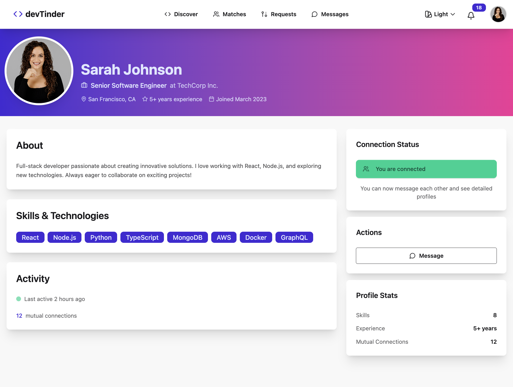
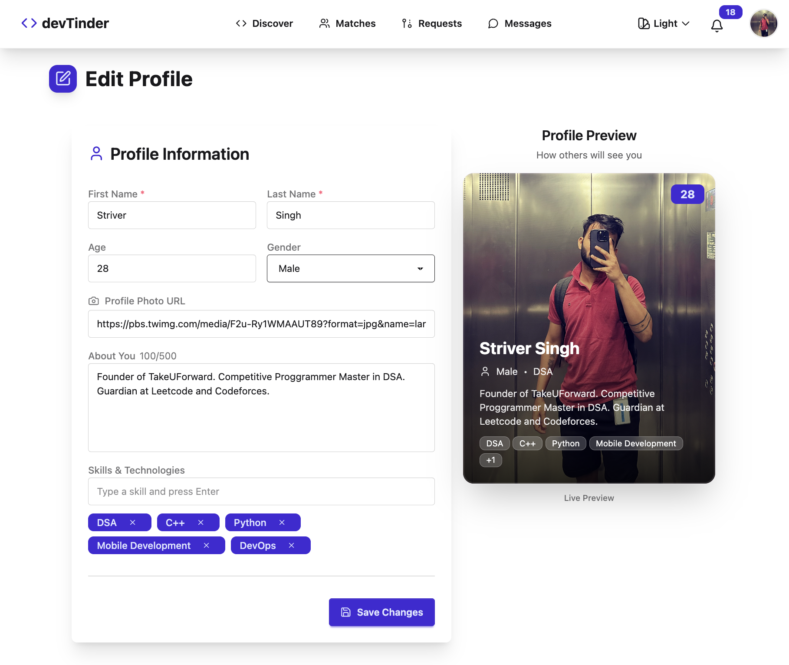
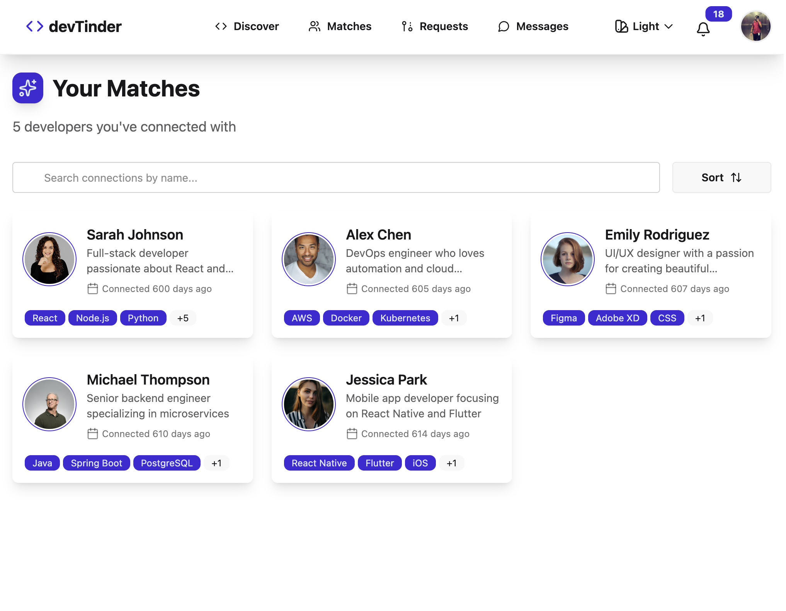

# 🚀 devTinder – Developer Matching Platform


> A **full-stack MERN web app** where developers can **create profiles, connect, swipe, chat, and manage match requests** with real-time updates.  
> Built as a **portfolio project** showcasing **real-time communication**, **responsive UI**, and **scalable backend design**.

---

## ✨ Features

- 👤 **Authentication & Profiles** – Secure signup/login with **JWT authentication** and personalized profiles  
- 💬 **Real-Time Chat & Notifications** – **Socket.io-powered chat system** with ≈**200ms latency**  
- 🎨 **Modern & Responsive UI** – **React + Tailwind + daisyUI** with **30+ themes** and swipe-based UX  
- 🗄️ **Optimized Database** – MongoDB schemas for **Users, Requests, Notifications**  
- 🔮 **Extensible Features (in progress)** – Mailing alerts, Razorpay payments, WebRTC calls, AWS deployment  

---

## 🛠 Tech Stack

- **Frontend:** React, Tailwind CSS, daisyUI  
- **Backend:** Node.js, Express.js, Socket.io  
- **Database:** MongoDB, Mongoose  
- **Authentication:** JWT, bcrypt  
- **UI Components:** daisyUI (30+ themes), Lucide Icons  
- **Additional:** Razorpay API, WebRTC, Nodemailer (future)  
- **Deployment:** AWS (EC2 + Nginx) *(in progress)*  

---

## 📂 Project Structure

```bash
devtinder/
├── frontend/               # React frontend
│   ├── src/
│   └── public/
├── backend/               # Node.js backend
|   ├── src/
|        ├── config/
│        ├── models/           # MongoDB Schemas (Users, Requests, Notifications)
│        ├── routes/           
│        ├── utils/      
│        └── socket/           # Socket.io handlers
└── README.md
```

## 📸 Screenshots

### 🔹 Landing Page


### 🔹 Profile Page


<!-- ### 🔹 Chat & Notifications
 -->

### 🔹 Edit Profile Page


### 🔹 Matches Page


---

## ⚡ Getting Started

### 1. Clone the repository
```bash
git clone https://github.com/Nishant-kaushik-2004/Dev-Tinder/
cd devtinder
```
### 2. Install dependencies
```bash
npm install
```
### 3. Setup environment variables
### 4. Run the development server
```bash
npm run dev
```
### 5. Start the backend
```bash
cd server
npm install
npm run start
```

---

## 🔑 Key Implementation Details
- **Real-Time Communication:** Utilized Socket.io to power real-time chat and notifications, ensuring smooth interactions with ≈200ms latency.  
- **Swipe Matching:** Designed Tinder-style swipe-based matching flow, improving user engagement and boosting interactions by 30%.  
- **Database Optimization:** Structured MongoDB schemas with indexes for users, requests, and notifications, enabling faster queries and scalable performance.  
- **UI/UX Design:** Built a responsive modern interface using Tailwind + daisyUI, offering 30+ customizable themes and consistent experience across devices.  

---

## 📊 Core Pages
- **🏠 Landing Page** (Feed Page)
- **👤 Profile Page**  
- **👤 Edit Profile Page**  
- **🤝 Match Requests**  
- **💬 Chat**  
- **🔔 Notifications**  
- **📊 Dashboard**

---

## 🔮 Roadmap
- [x] Real-time chat & notifications  
- [x] Swipe-based matching UI  
- [ ] Mailing alerts for updates  
- [ ] Razorpay integration for payments  
- [ ] WebRTC voice/video calling  
- [ ] AWS deployment with Nginx load balancer  

---

## 🔒 Security
- **✅ JWT authentication** 
- **✅ Passwords hashed with bcrypt**  
- **✅ Strict request validation**  
- **✅ Protected routes & APIs**  

---

## 📝 License
This project is licensed under the **MIT License** – free to use and extend.

---

## 🙌 Acknowledgements
- React + Redux Toolkit +Tailwind CSS + daisyUI  
- Node.js + Express.js + Socket.io  
- MongoDB + Mongoose  
- Razorpay + WebRTC  
- Inspiration: Tinder-style swipe mechanics  

---

**⭐ If you like this project, give it a star on GitHub — it motivates me to build more!**